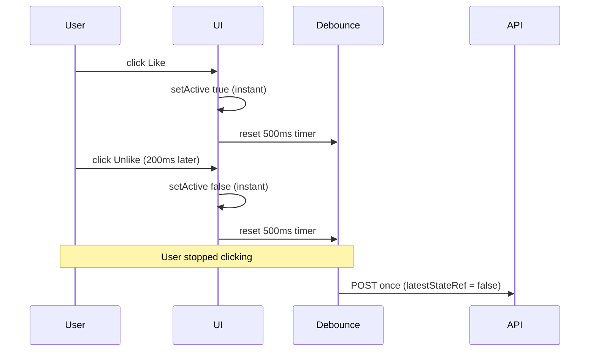

# togglelike API routes

Like / unlike with a Mongo transaction so `*Like` docs and `likedByCount` stay in sync.

## Routes

| Path | Source |
|------|--------|
| `POST /api/names/likes/[contentId]/togglelike` | [`names/.../route.ts`](../../../app/api/names/likes/[contentId]/togglelike/route.ts) |
| `POST /api/description/likes/[contentId]/togglelike` | [`description/.../route.ts`](../../../app/api/description/likes/[contentId]/togglelike/route.ts) |

Description route also returns **405** on `GET`.

## Request body

```json
{
  "contentCreator": {
    "_id": "...",
    "name": "...",
    "profileName": "...",
    "profileImage": "..."
  }
}
```

Only `contentCreator._id` is used (for `contentCreator` on the like doc and self-like `read` flag).

## Flow

1. `getSessionForApis` — 401 `"Unauthorized"` if not signed in
2. `findOne({ likedBy, contentId })` inside transaction
3. **Unlike:** delete like doc, `$inc: { likedByCount: -1 }`
4. **Like:** create like doc (`read: true` when liking own content), `$inc: { likedByCount: 1 }`
5. Response `{ liked: boolean }`

**Rate limit (429):** After auth, `checkLikeToggleRateLimit(userId)` — max **3 POSTs / 2 minutes** per user (shared preset with client). Response:

```json
{
  "message": "Too many like updates. Please try again soon.",
  "retryAfterSeconds": 42
}
```

E2E server mode uses a relaxed cap for serial UI tests; POSTs with header `x-e2e-strict-like-rate-limit: 1` apply the production cap. Reset counter via `POST /api/test/e2e/reset-like-toggle-rate-limit` (E2E only, signed in).

## Client: optimistic UI + settle-then-POST

The heart button does **not** POST on every click. [`useToggleState.ts`](../../../hooks/useToggleState.ts) wraps the API with a **trailing 500ms debounce**:

- **Every click** flips optimistic UI immediately (`setActive`, `onApplyOptimistic` via [`useLikeState.ts`](../../../hooks/useLikeState.ts)).
- **`latestStateRef`** stores the final intended liked state for the server.
- Each click calls `debouncedCommit()`, which **resets** the 500ms timer.
- **One POST** fires **500ms after the last click** in a burst, sending whatever `latestStateRef` holds at fire time.
- **`beforeunload` / unmount** calls `debouncedCommit.flush()` so a pending like is not lost when the user leaves the page.
- **Rate limit:** if `!canSend()`, `toggle()` returns before optimistic UI; [`LikesButtonAndLikesLogic.tsx`](../../../components/Shared/content-actions/LikesButtonAndLikesLogic.tsx) shows “Please wait X secs” (pagination-style cooldown).



### What is locked vs not

| Phase | Button disabled? | Optimistic UI updates? |
|-------|------------------|------------------------|
| Debounce waiting (0–500ms after last click) | **No** — unless rate-limited (`disabled={isProcessing \|\| isRateLimited}`) | **Yes**, every click (unless rate-limited) |
| Rate limit cooldown (`isRateLimited`) | **Yes** — “Please wait X secs” | **No** — `toggle` returns before `setActive` |
| Network in flight (`isProcessing`) | **Yes** | **No** — `toggle` returns early while fetch runs |

Users can correct an accidental like during the debounce window (e.g. unlike 200ms later); the timer resets and one POST reflects the final state.

### Edge cases

| Scenario | Behavior | Handled? |
|----------|----------|----------|
| Rapid clicks within 500ms | UI toggles on each click; **one POST** with final `latestStateRef` after last click | **Yes** — trailing debounce + `latestStateRef` |
| Like → pause &lt;500ms → unlike → stop | UI shows both changes; **one POST** (final state) 500ms after the unlike | **Yes** — timer resets on each click |
| Clicks ≥500ms apart | Each pause ends a burst → **separate POST** per burst. OS double-click at the ~500ms boundary behaves the same (two bursts, net-zero if toggled twice). | **Yes (intentional)** — user meant distinct actions |
| OS double-click ~500ms apart | UI toggles twice; may produce **two POSTs** (like then unlike) or one coalesced POST if gap &lt;500ms | **Yes (acceptable)** — final UI and DB match; extra POST only (rate limit / load), not special-cased |
| Click during in-flight POST | Ignored — no optimistic update; button `disabled={isProcessing}` | **Yes** — `if (isProcessing) return` in `toggle` |
| Rate limit (3 / 2 min) | Client blocks click **before** optimistic UI; button disabled + “Please wait X secs”; server returns **429** with `retryAfterSeconds` if bypassed | **Yes** — [`useApiRateLimiter`](../../../hooks/useApiRateLimiter.ts) + [`likeToggleRateLimit.ts`](../../../utils/api/likeToggleRateLimit.ts) |
| Fetch / network failure | UI rolls back; `onRollback` restores count / `LikesContext` maps | **Yes** — catch block in `debouncedCommit` |
| Tab close / unmount with pending debounce | `debouncedCommit.flush()` sends pending state | **Yes** — `beforeunload` listener + effect cleanup |
| Optimistic re-render (`setActive`) | Must not flush pending debounce on every render | **Yes (fixed)** — `canSendRef`; flush effect deps `[debouncedCommit]` only |
| Logged out click | Toast / message; no POST | **Yes** — sign-in gate in `LikesButtonAndLikesLogic` before `toggleLike` |

### Stack

```
LikesButtonAndLikesLogic.tsx
  → useLikeState.ts (count, LikesContext maps, rollback)
    → useToggleState.ts (debounce, rate limit, fetch)
      → POST .../togglelike
```

### Tests

| Layer | File | What it covers |
|-------|------|----------------|
| Unit | `hooks/useToggleState.test.ts` | Trailing debounce, burst coalescing, rollback, rate limit block + 429 rollback |
| Unit | `hooks/useApiRateLimiter.test.ts` | Sliding window, countdown, `applyServerCooldown` |
| Unit | `utils/api/rateLimiter.test.ts` | `likeToggle` preset (3 / 2 min) |
| Unit | `hooks/useLikeState.test.ts` | Optimistic count + LikesContext (mocked `useToggleState`) |
| E2E | `e2e/social.spec.ts` | Burst double-click → one POST; like → pause → unlike → one POST; 4th strict POST → 429 |
| E2E helpers | `e2e/helpers/likes.ts` | `ensureNameLiked` / `ensureNameUnliked`, `rapidDoubleClick`, production-rate-limit POST helper |

## Related

- [`docs/notes/models/likes-and-follows.md`](../models/likes-and-follows.md)
- [`GET /api/user/likes`](user-likes-route.md) — bulk fetch for `LikesContext`
- [`hooks/useLikeState.ts`](../../../hooks/useLikeState.ts) (uses [`useToggleState.ts`](../../../hooks/useToggleState.ts))
- [`LikesButtonAndLikesLogic.tsx`](../../../components/Shared/content-actions/LikesButtonAndLikesLogic.tsx) — listing heart UI
- [`ContainerForLikeShareFlag.tsx`](../../../components/Shared/content-actions/ContainerForLikeShareFlag.tsx) — shared action button chrome (like / share / thanks)
- [`ShareButton.tsx`](../../../components/Shared/content-actions/ShareButton.tsx) — listing share toggle
- `e2e/helpers/likes.ts`
